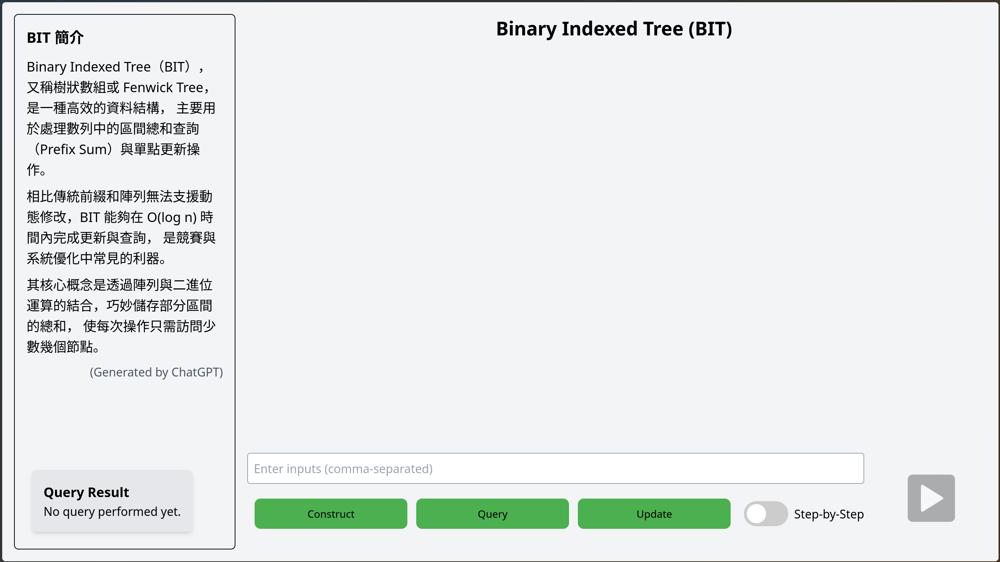
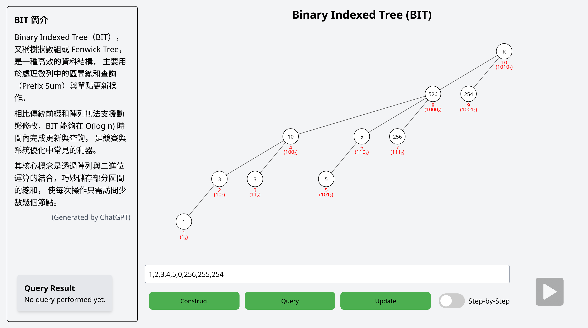

# BIT Documatation
## Introduction
This program demonstrates how binary indexed tree (BIT) works. It provides a visual representation of the BIT structure and the processes about constructing, querying, and updating in BIT. <br>
## Downloading and running
1. Clone the repository here:
https://github.com/WJ-Yen/DSA2025-SE-Group11
2. Install Node.js (https://nodejs.org/en/download)
3. Install Vite `npm install -D vite`
4. In the cloned repository, run `npm run dev` in command line.
5. Open the browser, the program should be running at http://localhost:5173/

## Usage
After successfully running the program, the interface should be like this:

First, the user have to input an multiset and construct the BIT.
- Input **at most 16** numbers within the range of **0~256**, use comma(",") to separate numbers.
    - e.g. {1,2,3,4,5,0,256,255,254}
- Click the 'Construct' button

If the input is valid, after clicking the button,  there will be a tree appears in the middle, and start constructing the BIT. After construction finished, it should look like this:


Now, user can choose to perform reconstruction, querying the sum of certain range, or updating value of a certain node.
- **Reconstruct the BIT**
Input new multiset and click the 'Construct' button. *It will overwrite the current structure.*
- **Query the sum of certain range**
Input 2 numbers represent the head index and tail index for querying. For example, {2,5} means query the sum from index 2 to index 5.
After input the numbers, click "Query" button, the tree will display the process of querying, and the query result will show at the bottom-left of the screen.
- **Update value of a certain node**
Input 2 numbers which represent the index of the node you would like to change and the value you would like it to change into, respectively. *(Note that the value should be within 0~256.)*
After input the numbers, click "Update" button, the tree will display the process of updating.

Furthermore, we design the **"Step-by-Step"** feature for user to understand how the BIT work more easily.
- To enable the step-by-step mode, click the "Step-by-Step" switch at the bottom. The button at the bottom-right (which is "Next" button) will turn green.
*If there is a operation ongoing, switch on step-by-step mode will __not__ stop current animation. It only affect the operations start after the mode is on.*
- When the step-by-step mode is enable, all the operation will stop after updating/ querying a value. Until user double-click the green "Next" button, it will show the next step of operation.
- If the operation has not finish yet, the "Next" button will be bright green. Otherwise, it will be dim green.
- If one wants to disable step-by-step mode, simply switchs off the "Step-by-Step" switch. **Please don't switch off while there is a operation ongoing.**

## State Explanation
- Node Colors: 
    - White: Default state.
    - Red: The node is currently modifying or querying.

## Operation Process Explanation
- Define a function **lowbit(i)** return the least significant (or smallest/ rightmost) "1" in i in binary.
For example, 5 = (101)~2~, lowbit(5) = 1; 8 = (1000)~2~, lowbit(8) = 8
### Construct
1. The program parse the input into array with size n.
2. Draw a tree with n+1 node.
    - Index n+1 is the root.
    - The parent of any node i is ```i + lowbit(i)```, if ```i + lowbit(i) <= n```. Otherwise, the parent will be the root (n+1).
    - For example, if n = 10, parent(5) = 5 + lowbit(5) = 6; parent(8) will be 11, since 8 + lowbit(8) = 16, which is larger than 10.
3. Looping i from 1 to n:
    - ```Node[i] += InputArray[i]``` (Node i turns red)
    - If parent(i) <= n, ```Node[parent(i)] += Node[i]``` (Node parent(i) turns red, Node i turns white)
    - Otherwise, continue the loop. (Node i turns white)
4. After the loop, construction complete.

### Query
1. Define a function **Sum(i)**, return the prefix sum from index 1 to i.
    - Initialize ```sum = 0```. Loop while i > 0:
        - ```sum += Node[i]``` (Node i turns red)
        - ```i -= lowbit(i)``` (Node i turns white)
    - After the loop, return ```sum```.
    - For example, if the input array is {1,2,3,4,5}, Sum(3) = Node[3] + Node[2] = 3 + 3 = 6.
2. Parse the input into two number, the smaller number is left_index, the other is right_index.
3. If left_index is equal to 1, return ```Sum(right_index)```. Otherwise, return ```Sum(right_index) - Sum(left_index - 1)``` 

### Update
1. Parse the input into two number, index and value, respectively.
2. Let ```original_value = Node[index]```
3. Loop while index <= n:
    - ```Node[index] += value - original_value``` (Node index turns red)
    - ```index += lowbit(index)``` (Node index turns white)
4. After the loop, update complete.

### Example
1. Construct(1,2,3,4,5,6,7,8)
    - Node = {1,3,3,10,5,11,7,36}
2. Query(5,7)
    - (Node[7] + Node[6] + Node[4]) - (Node[4]) = 7 + 11 + 10 - 10 = 18
3. Update(3, 100)
    - original_value = Node[3] = 3
    - Node[3] = 3 + 100 - 3 = 100
    - Node[4] = 10 + 100 - 3 = 107
    - Node[8] = 36 + 100 - 3 = 133

## Contribution
- **Project Manager**: 顏暐哲
- **Frontend Engineer**: 李贊韻
- **Backend Engineer**: 王獻宇、温智方
- **Quality Assurance**: 郭柏毅、黃翊峰
